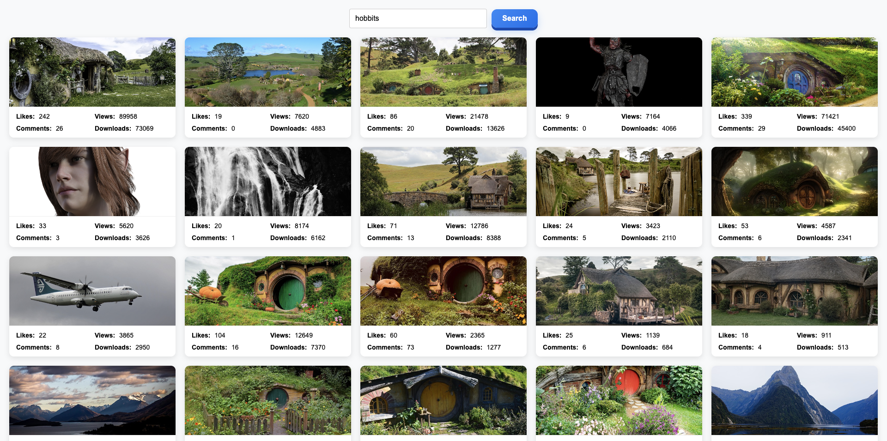

# 🔎 Image Search App 

A vanilla JS app that searches photos via **Pixabay API**, shows a gallery with **SimpleLightbox**, notifications with **iziToast**, and supports **pagination** with a “Load More” flow. Built with **Vite**, uses **Axios** + **async/await**, and keeps the console clean (no errors/warnings).

---
## 📸 Preview



---

## 🚀 Demo
- **Live (Vercel):** https://zekirovskii.github.io/goit-js-hw-12/
- **Repository:** https://github.com/zekirovskii/js-image-search-app


---

## ✨ Features
- Keyword-based search (Pixabay)
- Paginated results + **Load More**
- **SimpleLightbox** for large image preview
- **iziToast** notifications (empty results, errors, etc.)
- Loader visibility + smooth scroll into new results
- Clean async flow with **async/await**

---

## 🛠 Tech
- JavaScript (ES Modules)
- Vite
- Axios
- SimpleLightbox
- iziToast
- Prettier

---

## 🔑 API Setup (Pixabay)
1. Get a free API key: https://pixabay.com/api/docs/
2. Create `.env` in project root:
VITE_PIXABAY_KEY=your_api_key_here
3. Typical request params (example):
- `q`, `page`, `per_page`
- `image_type=photo`
- `orientation=horizontal`
- `safesearch=true`

---
```
## 📂 Project Structure
goit-js-hw-12-image-search/
│
├─ public/
│ └─ screenshots/
│ ├─ home.png
│ └─ modal.png
│
├─ src/
│ ├─ js/
│ │ ├─ pixabay-api.js # Axios requests (searchImages)
│ │ ├─ render-functions.js # renderGallery, clearGallery, lightbox refresh, UI toggles
│ │ └─ index.js # main logic (form submit, pagination, toasts, scroll)
│ ├─ css/
│ │ └─ styles.css
│ ├─ index.html
│ └─ main.js # imports styles/libs, bootstraps app
│
├─ .env # VITE_PIXABAY_KEY=...
├─ .prettierrc
├─ package.json
└─ README.md
```
---

## ▶️ Run Locally
```bash
# Clone
git clone https://github.com/username/goit-js-hw-12-image-search.git
cd goit-js-hw-12-image-search

# Install
npm install

# Dev
npm run dev

# Build
npm run build

# Preview build
npm run preview
Vercel Deploy
Framework preset: Vite
Build command: npm run build
Output: dist
Env var: VITE_PIXABAY_KEY
✅ Notes for Review
Uses Axios + async/await
Errors handled via try/catch + iziToast
Pagination with page, per_page; “Load More” fetches next page
Gallery cleared on new search; loader & button visibility toggled correctly
SimpleLightbox refreshed after each render
Console is clean (no warnings/errors)
Code formatted with Prettier
📝 License
MIT © 2025
